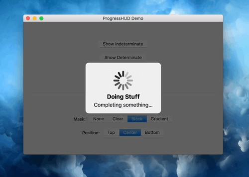
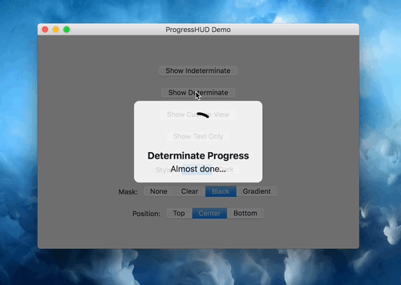

# ProgressHUD
A Progress HUD for Mac


### Displays a simple HUD view containing a progress indicator and optional title and message
 
 
 
 

The ProgressHUD window spans over the entire space given to it by the initWithFrame constructor and catches all
user input on this region, thereby preventing the user operations on components below the view. The HUD itself is
drawn centered as a rounded semi-transparent view which resizes depending on the user specified content.

This view supports vaious modes of operation (ProgressHUDMode):
 - `indeterminate` shows a UIActivityIndicatorView
 - `determinate` shows a custom round progress indicator
 - `customView` shows an arbitrary, user specified view
 - `text` shows only the text labels

The API hides the actual ProgressHUD behind a few NSView extensions methods:
```
func showProgressHUD(title: String, 
                     message: String, 
                     mode: ProgressHUDMode, 
                     settings: ProgressHUDSettings, 
                     duration: TimeInterval)
func setProgressHUDProgress(_ progress: Double)
func hideProgressHUD(afterDelay delay: TimeInterval) 
```
